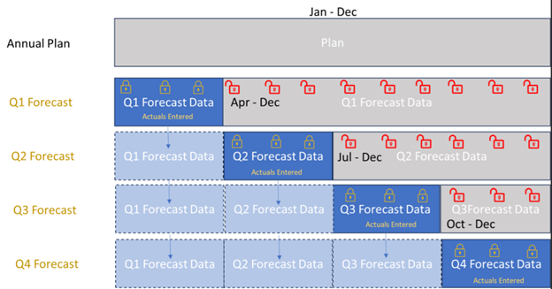

# Modelo de datos para registros repetidos

## 1. Introducción.
Se requiere crear un modelo de datos en el cual los valores numericos de los rectangulos azul claro se compartan entre Forecasts.

Por ejemplo, los primeros 3 candados (asi sucesivamente) son datos numericos relacionados con "Q1 Forecast", se copian a los "Forecasts" siguientes y se pueden modificar en cualquiera de ellos. Si el primer dato numero relacionado con el primer candado se modifica en "Q4 Forecast",el cambio se reflejaria en todos los "Forecasts" precedentes.   

El objetivo es modelar una forma de compatir los datos numericos si tener registros repetidos.  

## 2. Demo

- Ejecute el notebook forecast_app.ipynb que muestra la implementación del proceso planteado.

## 3. Explicación del modelo de datos.

Para modelar una manera de compartir los datos partimos de que una serie (Q1_Forecast, Q2_Forecast, Q3_Forecast, Q4_Forecast) puede tener dos componentes:
- Compartido
- Propio

El componente compartido aquel cuyo valor se replica entre series y corresponde al mostrado en color azul (claro y oscuro) en la imagen.
El componente propio es aquel cuyo valor no se replica entre series (si estas lo permiten).

De esta manera, los componentes para las series  son:

|Serie|Compartido|Propio|
|--|--|--|
| Q1 Forecast | Enero a Marzo | Abril a Diciembre |
| Q2 Forecast | Enero a Junio| Julio a Diciembre |
| Q3 Forecast | Enero a Septiembre | Octubre a Diciembre |
| Q4 Forecast | Enero a Diciembre | NA |

De esta manera si definimos los siguientes conjuntos de meses:
- A = {Ene, Feb, Mar}
- B = {Abr, May, Jun}
- C = {Jul, Ago, Sep}
- D = {Oct, Nov, Dic}

Podremos ver que:

- Q1 Forecast = A + Componente Propio de Q1_Forecast
- Q2 Forecast = A + B + Componente Propio de Q2_Forecast
- Q3 Forecast = A + B + C + Componente Propio de Q3_Forecast
- Q3 Forecast = A + B + C + D

Ejemplos de funcionamiento.
- Al actualizar el valor Mayo en Q3_Forecast y posteriormente replicarlo a Q2_Forecast y Q4_Forecast, es en realidad actualizar el valor en el conjunto B, para la llave "May".
- Al actualizar el valor de Septiembre en Q1_Forecast, como este periodo para esa serie hacer parte de la parte propia de Q1_Forecast, no se actualiza en ninguna otra serie